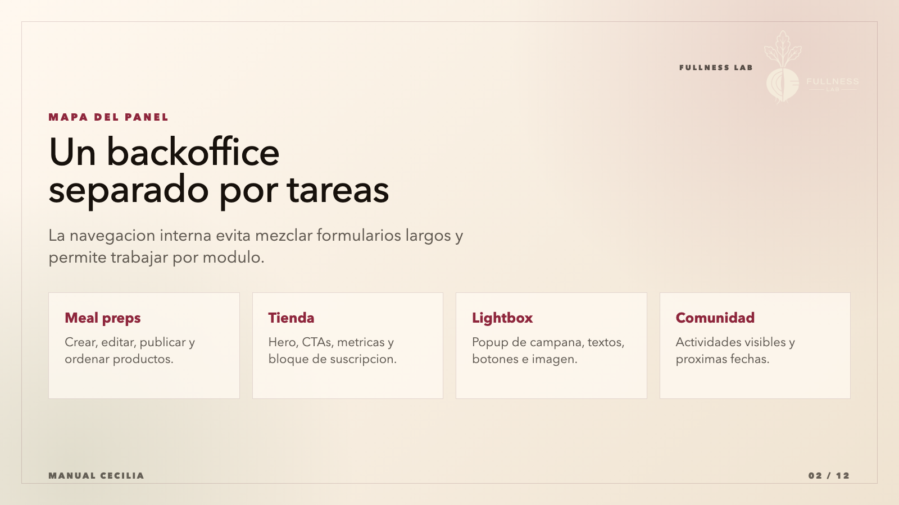
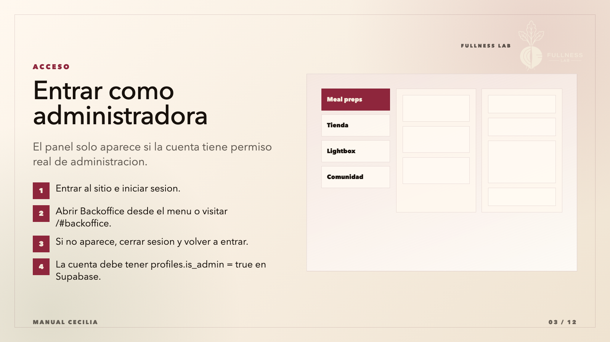
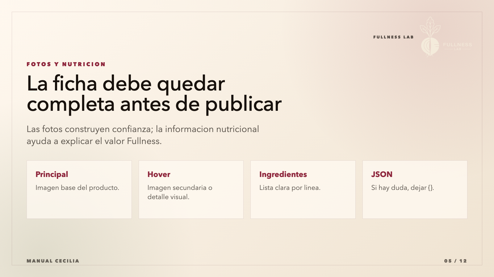
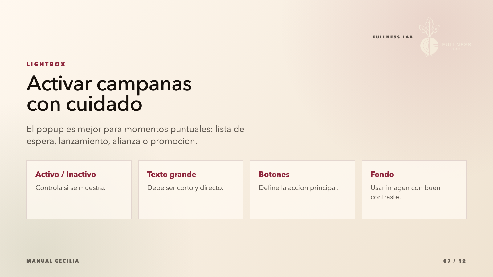
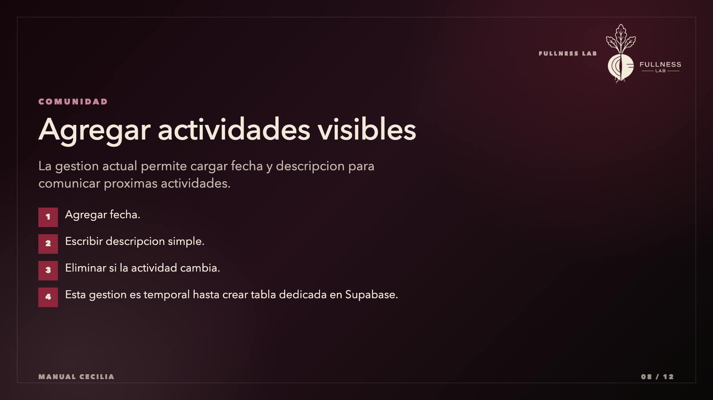
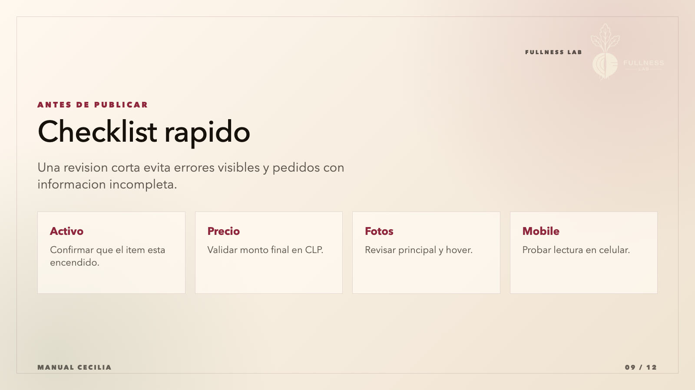
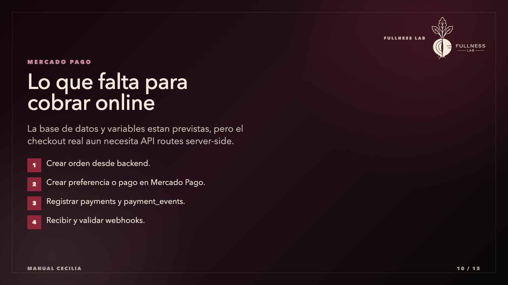
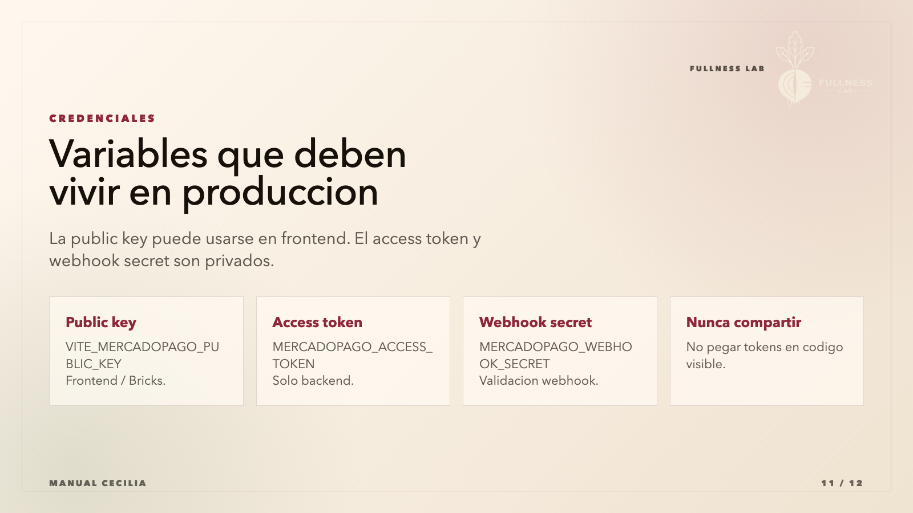
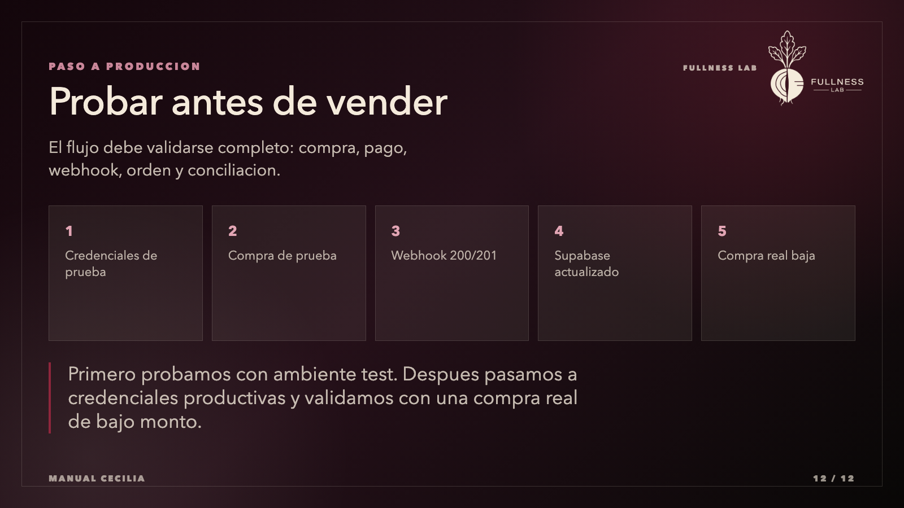

# Presentacion En Imagenes: Manual Cecilia

Carpeta de laminas:

`demo-clienta/manual-cecilia-presentacion/slides`

Formato:

- PNG
- 1600 x 900 px
- 12 laminas

## Orden

1. 
2. 
3. 
4. 
5. 
6. 
7. 
8. 
9. 
10. 
11. 
12. 

## Fuente Editable

- `index.html`: diseno editable de las laminas.
- `export-slides.mjs`: exporta nuevamente los PNG desde Chrome headless.

Para regenerar:

```bash
node demo-clienta/manual-cecilia-presentacion/export-slides.mjs
```
