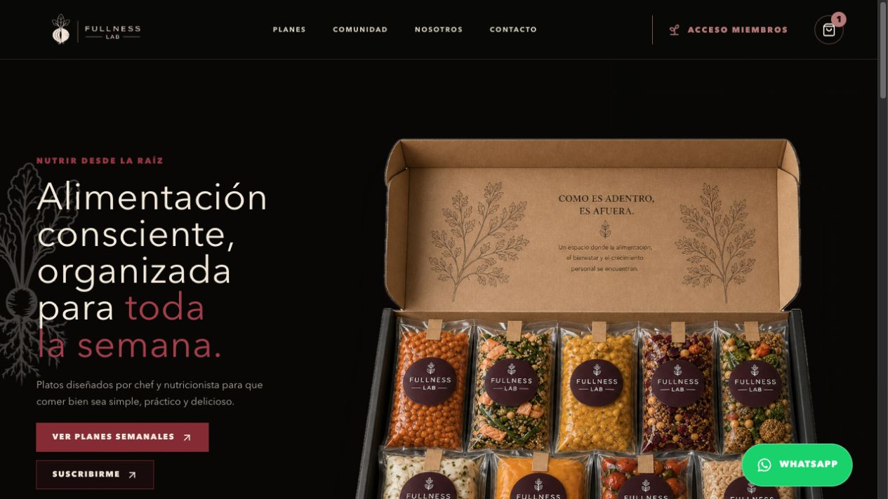
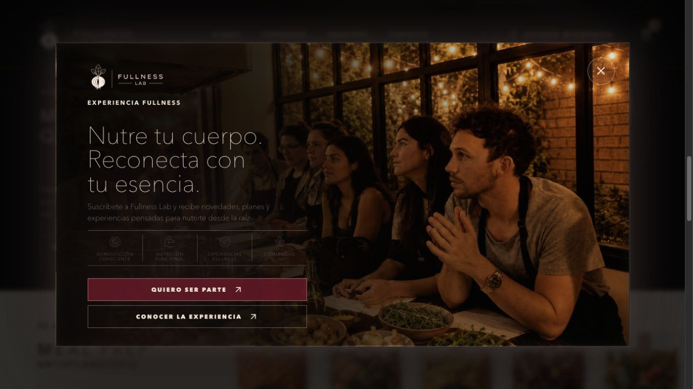
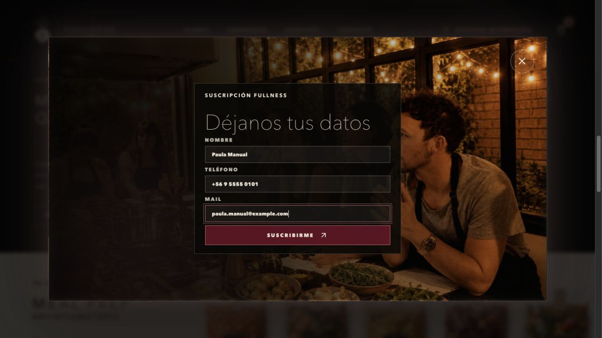
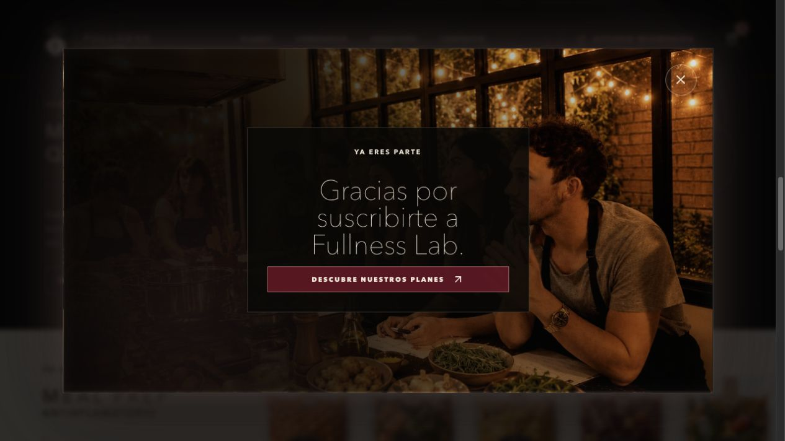
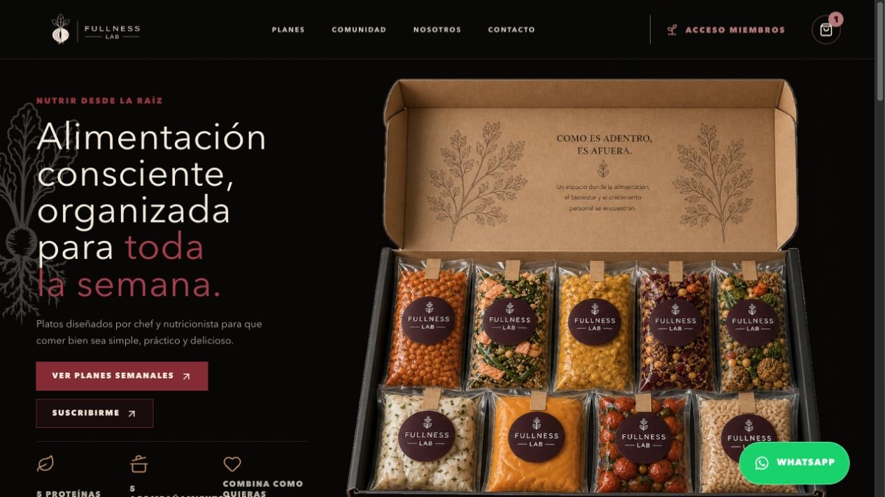
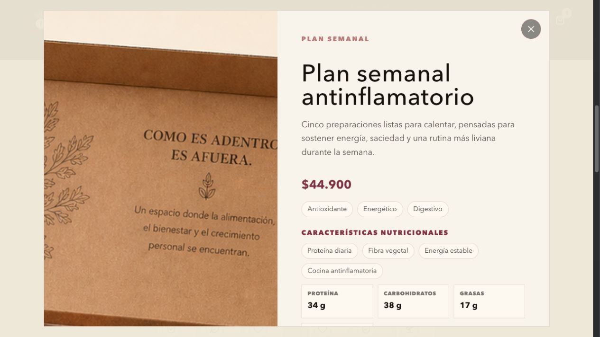
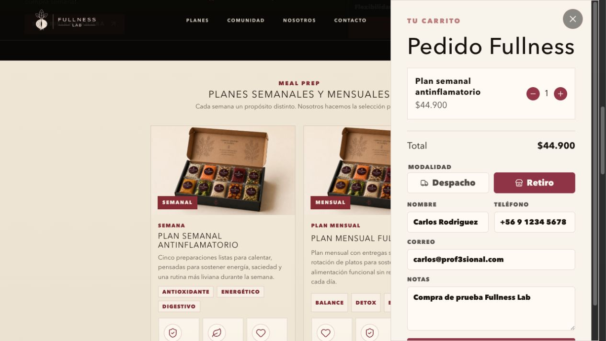
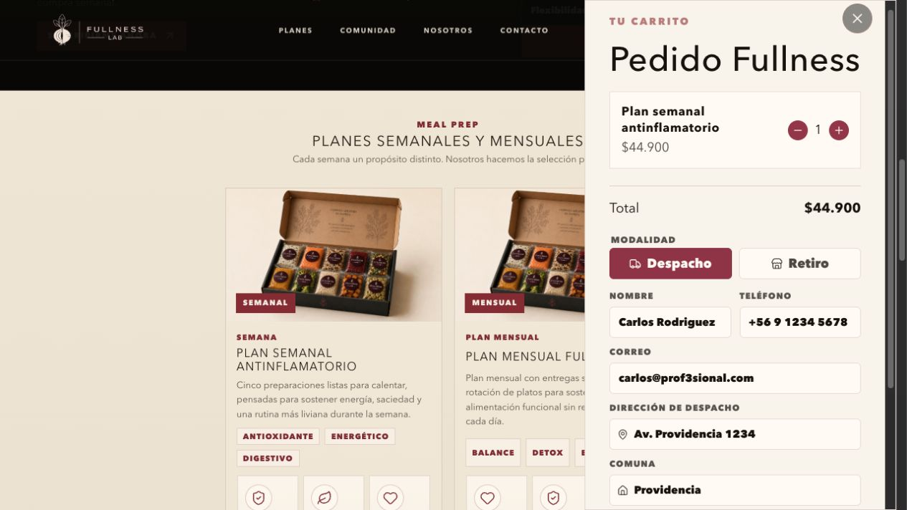

# Manual Visual: Inscripción Y Compra Fullness

Fecha de recorrido: 2026-07-21

Este recorrido usa la tienda local en `http://localhost:3101`. Los datos visibles son datos de QA; no corresponden a una compra real.

## 1. Entrar A Fullness

La persona llega a la portada y puede explorar la propuesta de Fullness antes de avanzar a planes.

## 2. Conocer El Pop-up

Después de recorrer la portada, aparece el lightbox de experiencia Fullness. La persona selecciona `Quiero ser parte`.

## 3. Completar Inscripción

La inscripción solicita nombre, teléfono y mail. Al enviar el formulario, la pantalla confirma el registro.

Nota actual: la confirmación del pop-up funciona en pantalla y la inscripción queda guardada en el navegador. Todavía no existe un servicio de email configurado para enviar una bienvenida automática.

## 4. Elegir Un Plan

Desde el botón `Descubre nuestros planes`, la persona llega a la tienda. Puede abrir un plan para revisar precio, beneficios, información nutricional y meal preps incluidos.

## 5. Preparar El Pedido

Al agregar un plan se abre el carrito. La persona elige entre retiro en local o despacho e ingresa sus datos antes de continuar a Mercado Pago.

## 6. Pagar En Mercado Pago

El botón `Pagar con Mercado Pago` crea una preferencia segura en backend y redirige al Checkout Pro. Las capturas de la selección de medio y la revisión previa están en [QA Mercado Pago](../mercadopago/README.md):

- [Selección de medio de pago](../mercadopago/03-mercadopago-metodo.png)
- [Tarjeta de prueba](../mercadopago/04-tarjeta-prueba.png)
- [Resumen previo al pago](../mercadopago/05-resumen-antes-de-pagar.png)

## Estado Del Correo De Compra

No hay un correo de compra recibido ni una captura de retorno aprobado: la última prueba Sandbox fue bloqueada por Mercado Pago antes de crear un pago. Además, el proyecto no tiene un proveedor de correo transaccional configurado, por lo que no debe prometer ni simular una confirmación automática.

Para cerrar el flujo completo se necesitan dos hitos reales: una aprobación Sandbox de Mercado Pago y un proveedor de email transaccional con credenciales de servidor. Una vez resueltos, se agregan las capturas de retorno aprobado, la recepción del correo y la conciliación de `orders`/`payments`.
